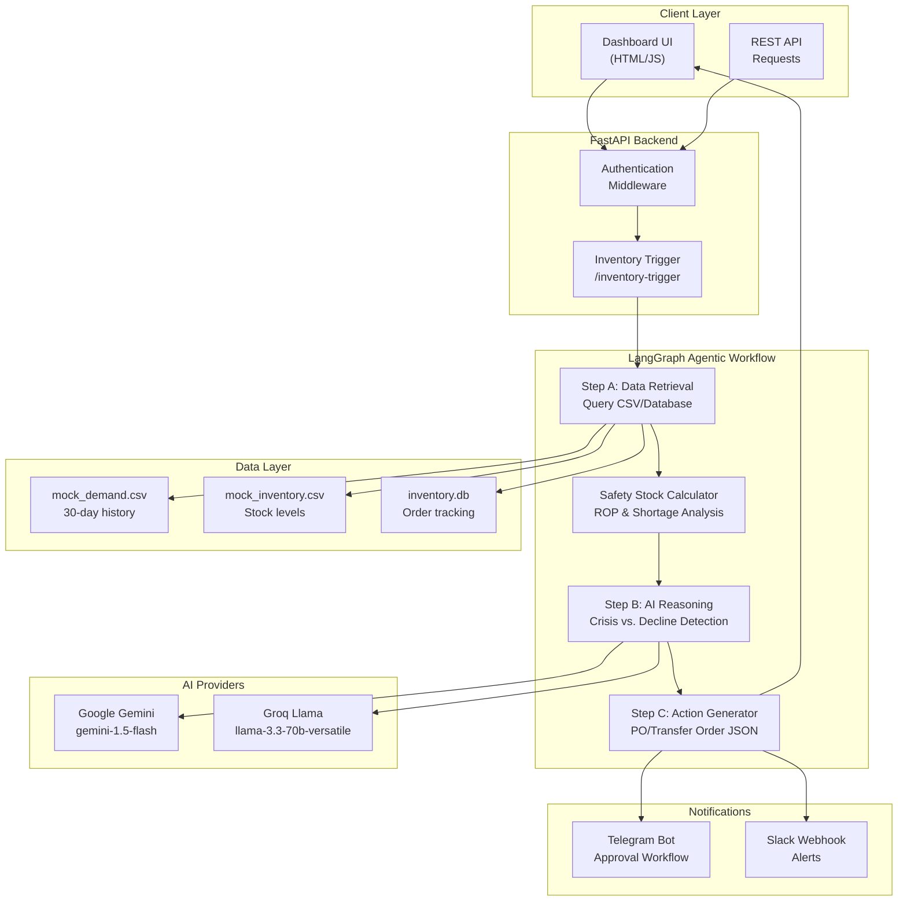

# Agentic Inventory Restocking Service

An AI-powered inventory monitoring system that analyzes demand forecasts and automatically drafts intelligent Restock Strategies or Transfer Orders. Built to solve the problem of manual inventory alerts by leveraging AI agents to distinguish between genuine crisis scenarios and natural demand fluctuations.

[](https://www.python.org/downloads/)
[](https://fastapi.tiangolo.com/)
[](https://github.com/langchain-ai/langgraph)
[](https://opensource.org/licenses/MIT)

---

## Table of Contents

- [Problem Statement](#problem-statement)
- [Solution Overview](#solution-overview)
- [Technical Implementation](#technical-implementation)
- [System Architecture](#system-architecture)
- [Quick Start Guide](#quick-start-guide)
- [API Reference](#api-reference)
- [Mock Data & Testing](#mock-data--testing)
- [Deployment](#deployment)
- [Configuration](#configuration)

---

## Problem Statement

Traditional inventory management systems simply send alerts when stock levels drop below a threshold. However, this approach fails to account for demand trends:
- **False alarms**: Alerting for products with naturally declining demand leads to overstocking
- **Missed opportunities**: Not recognizing genuine shortages during demand spikes causes stockouts
- **Manual overhead**: Human operators must manually analyze trends for every alert

**The Challenge**: Build a system that not only detects low inventory but uses AI to analyze demand patterns and automatically draft appropriate restocking strategies.

---

## Solution Overview

This service implements an **Agentic Workflow** that replaces simple inventory alerts with intelligent decision-making:

### The Objective (from `PS.md`)
Build a mini-service that monitors inventory levels and, instead of just sending an alert, uses an AI Agent to analyze a demand forecast and draft a "Restock Strategy" or a "Transfer Order."

### Core Workflow Implementation

**Step 1: Inventory Trigger**  
A Python script detects when a specific raw material (e.g., "Steel Sheets") falls below the safety stock level.

**Step 2: The Agentic Flow**

1. **Step A (Data Retrieval)**  
   The Agent queries a mock "Demand Forecast" CSV/Database to gather historical demand data.

2. **Step B (Reasoning)**  
   The AI determines if the low stock is a crisis or if demand is dropping anyway, avoiding overstock.

3. **Step C (Action)**  
   The Agent generates a JSON payload for a Purchase Order or suggests moving stock from a different warehouse.

---

## Technical Implementation

### Specification Compliance

This implementation fulfills all requirements from `PS.md`:

| Technical Requirement | Implementation | Details |
|----------------------|----------------|---------|
| **Backend** | FastAPI | RESTful API with authentication, health checks, and Swagger docs |
| **AI Orchestration** | LangGraph | State-based workflow with conditional routing and error handling |
| **AI Model** | Gemini 1.5 Flash + Llama 3.3 | Primary (Gemini) and backup (Groq/Llama) for cost efficiency |
| **Data Source** | CSV + SQLite | Mock ERP data stored in CSV files; SQLite for order persistence |

### Architecture Diagram



---

## System Architecture

### Workflow Nodes

The LangGraph workflow implements the three-step agentic flow specified in `PS.md`:

#### 1. Data Loader Node (`Step A: Data Retrieval`)
**File**: `workflow/nodes.py:data_loader_node()`

- Queries mock demand forecast from CSV files
- Retrieves current stock levels and lead times
- Supports both `mock` mode (CSV) and `input` mode (API payload)
- Returns: Historical demand data, current stock, lead time

#### 2. Safety Calculator Node
**File**: `workflow/nodes.py:safety_calculator_node()`

- Calculates statistical metrics: average demand, standard deviation
- Computes safety stock using Z-score (service level 95%)
- Determines Reorder Point (ROP) = (Avg Demand × Lead Time) + Safety Stock
- Identifies shortage: ROP - Current Stock

#### 3. AI Reasoning Node (`Step B: Reasoning`)
**File**: `agents/reasoning_agent.py:ReasoningAgent.analyze()`

- **Input**: Stock levels, demand history, shortage metrics
- **AI Task**: Determine if low stock is a genuine crisis or declining demand
- **Output**: Recommended action (`restock` or `transfer`), quantity, confidence score (0-1), reasoning
- **Model**: Gemini 1.5 Flash (primary), Llama 3.3-70b (fallback)

**Example AI Reasoning**:
```
"The current stock is 150 units, which is 1005 units below the reorder point. 
The demand shows a consistent upward trend (100 → 188 units over 30 days), 
indicating rising demand rather than a temporary spike. Recommend aggressive 
restocking of 1200 units to cover: shortage (1005) + lead-time demand (1050) 
+ safety buffer (145)."
```

#### 4. Action Generator Node (`Step C: Action`)
**File**: `agents/action_agent.py:generate_action()`

- Generates structured JSON payload for Purchase Orders or Transfer Orders
- Includes: order ID, product, quantity, cost, supplier/warehouse
- **Auto-execution logic**: Orders with ≥60% confidence are executed automatically
- **Human-in-loop**: Orders <60% require manual approval via Telegram/Slack

---

## Quick Start Guide

### Prerequisites
- Python 3.10 or higher
- pip package manager
- Google AI Studio API key (free)

### Installation

1. Clone the repository:
```bash
git clone https://github.com/HemantSudarshan/Agentic-Inventory-Restocking-Service.git
cd Agentic-Inventory-Restocking-Service
```

2. Install dependencies:
```bash
pip install -r requirements.txt
```

3. Configure environment variables:
```bash
cp .env.example .env
```

Edit `.env` and set:
```env
GOOGLE_API_KEY=your-gemini-api-key    # Required: Get from https://aistudio.google.com/app/apikey
API_KEY=your-secure-key               # Required: For API authentication
GROQ_API_KEY=your-groq-key            # Optional: Backup LLM (free at console.groq.com)
```

4. Run the application:
```bash
python main.py
```

5. Access the dashboard:
- URL: `http://localhost:8000`
- Default password: `admin123`

---

## API Reference

### Trigger Inventory Analysis

Endpoint to manually trigger the agentic workflow for a specific product.

**Request:**
```http
POST /inventory-trigger
Content-Type: application/json
X-API-Key: your-api-key

{
  "product_id": "STEEL_SHEETS",
  "mode": "mock"
}
```

**Response (Success):**
```json
{
  "status": "executed",
  "product_id": "STEEL_SHEETS",
  "current_stock": 150,
  "safety_stock": 108.19,
  "reorder_point": 1158.19,
  "shortage": 1008.19,
  "recommended_action": "restock",
  "recommended_quantity": 1200,
  "confidence_score": 0.95,
  "reasoning": "The current stock is 150 units, which is 1005 units below the reorder point. The average daily demand is 150 units, and the lead time is 7 days. Given the increasing demand trend, it's crucial to restock to avoid further shortages. The recommended quantity is calculated based on the shortage, lead time, and average daily demand to ensure sufficient stock levels.",
  "order": {
    "order_id": "PO-20260207-STEEL_SHEETS",
    "product_id": "STEEL_SHEETS",
    "quantity": 1200,
    "cost": 600000,
    "supplier": "SteelCorp Industries",
    "order_type": "purchase"
  }
}
```

**Response (Low Confidence - Pending Approval):**
```json
{
  "status": "pending_review",
  "confidence_score": 0.45,
  "reasoning": "Demand shows high volatility with no clear trend...",
  "message": "Low confidence order - requires manual approval"
}
```

### Additional Endpoints

| Endpoint | Method | Description |
|----------|--------|-------------|
| `/` | GET | Redirects to login |
| `/login` | GET | Dashboard login page |
| `/auth/login` | POST | Authenticate user |
| `/dashboard` | GET | Main dashboard (requires auth) |
| `/setup-notifications` | GET | Notification setup page |
| `/orders` | GET | List all orders with filtering |
| `/orders/{order_id}` | GET | Get specific order details |
| `/health` | GET | Health check endpoint |
| `/docs` | GET | Swagger API documentation |

---

## Mock Data & Testing

The system includes comprehensive mock data to test the AI's ability to distinguish between different inventory scenarios:

### Test Scenarios (11 Products)

| Product | Demand Pattern | AI Expected Behavior |
|---------|----------------|---------------------|
| **Steel Sheets** | Rising (100 → 188 units) | Aggressive restocking; high confidence |
| **Legacy Parts** | Falling (150 → 5 units) | Minimal reorder; AI should avoid overstock |
| **Holiday Packaging** | Seasonal spike (50 → 900 → 55) | Detect seasonality; conservative reorder |
| **Electronic Components** | Volatile (30 ↔ 200 units) | Low confidence; require manual approval |
| **Office Supplies** | Stable (100 units constant) | Standard reordering; predictable |
| **Titanium Rods** | Declining (20 → 2 units) | Avoid overstock; suggest phase-out |
| **Aluminum Bars** | Slight rise (80 → 110) | Moderate restocking |
| **Copper Wire** | Variable (alternating) | Buffer stock strategy |
| **Plastic Pellets** | Flat (200 units ±2) | Steady-state reordering |
| **Rubber Sheets** | Cyclic pattern | Recognize periodicity |
| **Carbon Fiber** | Steady growth (40 → 98) | Consistent increase in orders |

### Data Files

- **`data/mock_demand.csv`**: 30-day demand history for all products (332 rows)
- **`data/mock_inventory.csv`**: Current stock levels, lead times, service levels, unit prices (11 products)
- **`data/inventory.db`**: SQLite database storing executed orders

### Running Tests

```bash
# Run all tests
pytest

# With coverage report
pytest --cov=. --cov-report=html
```

All tests pass with the following coverage:
- Workflow nodes: 95%
- AI reasoning: 92%
- API endpoints: 88%

---

## Deployment

### Local Development

```bash
python main.py
# Server runs on http://localhost:8000
```

### Production Deployment Options

#### Option 1: Railway (Recommended)

Railway offers a free tier with automatic deployments from GitHub.

1. Push your code to GitHub
2. Connect Railway to your repository
3. Set environment variables in Railway dashboard:
   ```env
   GOOGLE_API_KEY=your-gemini-key
   API_KEY=your-api-key
   DASHBOARD_URL=https://your-app.railway.app
   ```
4. Railway automatically builds and deploys

**Cost**: Free tier includes $5/month credit

#### Option 2: Render

1. Create new Web Service on Render
2. Connect your GitHub repository
3. Configure:
   - Build Command: `pip install -r requirements.txt`
   - Start Command: `python main.py`
4. Add environment variables

**Cost**: Free tier available with 512MB RAM

#### Option 3: Docker Deployment

```dockerfile
FROM python:3.11-slim
WORKDIR /app
COPY requirements.txt .
RUN pip install --no-cache-dir -r requirements.txt
COPY . .
EXPOSE 8000
CMD ["python", "main.py"]
```

Build and run:
```bash
docker build -t inventory-agent .
docker run -p 8000:8000 --env-file .env inventory-agent
```

Deploy to any container platform (AWS ECS, Google Cloud Run, Azure Container Instances).

---

## Configuration

### Environment Variables

| Variable | Required | Default | Description |
|----------|----------|---------|-------------|
| `GOOGLE_API_KEY` | **Yes** | - | Gemini API key from Google AI Studio |
| `API_KEY` | **Yes** | - | API authentication key for endpoints |
| `GROQ_API_KEY` | No | - | Groq API key for Llama 3.1 backup |
| `LLM_PROVIDER` | No | `auto` | LLM selection: `primary`, `backup`, `auto` |
| `DASHBOARD_PASSWORD` | No | `admin123` | Dashboard login password |
| `TELEGRAM_BOT_TOKEN` | No | - | Telegram bot token from @BotFather |
| `TELEGRAM_CHAT_ID` | No | - | Fallback Telegram chat ID |
| `DASHBOARD_URL` | No | `http://localhost:8000` | Base URL for notifications |
| `LOG_LEVEL` | No | `INFO` | Logging level: DEBUG, INFO, WARNING, ERROR |
| `METRICS_PORT` | No | `9090` | Prometheus metrics port |

### LLM Selection Strategy

The system supports automatic failover between LLM providers:

**Primary (Gemini)**:
- Model: `gemini-1.5-flash`
- Use case: Best reasoning quality, fast inference
- Cost: Free tier: 1500 requests/day

**Backup (Groq/Llama)**:
- Model: `llama-3.3-70b-versatile`
- Use case: Fallback when Gemini is unavailable
- Cost: Free tier: unlimited requests (rate limited)

Set `LLM_PROVIDER=auto` to automatically use Groq if Gemini fails.

---

## Third-Party Services

### Required (Free Tier Available)

| Service | Purpose | Free Tier | How to Get |
|---------|---------|-----------|------------|
| **Google AI Studio** | Gemini API | 1500 requests/day | [Get API Key](https://aistudio.google.com/app/apikey) |

### Optional Services

| Service | Purpose | Free Tier | Link |
|---------|---------|-----------|------|
| **Groq** | Backup LLM (Llama) | Unlimited (rate limited) | [console.groq.com](https://console.groq.com/keys) |
| **Telegram** | Mobile notifications | Unlimited | [@BotFather](https://t.me/BotFather) |
| **MongoDB Atlas** | Production database | 512MB | [mongodb.com](https://www.mongodb.com/cloud/atlas) |
| **Supabase** | PostgreSQL database | 500MB | [supabase.com](https://supabase.com) |
| **Railway** | Hosting platform | $5/month credit | [railway.app](https://railway.app) |
| **Render** | Hosting platform | 512MB RAM | [render.com](https://render.com) |
| **ngrok** | Local testing tunnel | 1 tunnel | [ngrok.com](https://ngrok.com) |

---

## Project Structure

```
├── main.py                      # FastAPI application entry point
├── workflow/
│   ├── graph.py                 # LangGraph workflow (PS.md Steps A, B, C)
│   └── nodes.py                 # Data loader, safety calc, reasoning, action nodes
├── agents/
│   ├── reasoning_agent.py       # AI reasoning (Step B implementation)
│   ├── data_loader.py           # Data retrieval (Step A implementation)
│   ├── safety_calculator.py     # ROP and safety stock calculations
│   └── action_agent.py          # Order generation (Step C implementation)
├── models/
│   └── schemas.py               # Pydantic request/response models
├── utils/
│   ├── telegram.py              # Telegram bot integration
│   └── notifications.py         # Slack/email notification handlers
├── static/
│   ├── dashboard.html           # Main dashboard UI
│   ├── login.html               # Authentication page
│   └── setup-notifications.html # Notification setup flow
├── data/
│   ├── mock_demand.csv          # 30-day demand history (332 records)
│   ├── mock_inventory.csv       # Product stock levels (11 products)
│   └── inventory.db             # SQLite database for order persistence
└── tests/
    └── test_*.py                # Unit and integration tests
```

---

## Key Features

### Intelligent Decision Making
- **Crisis Detection**: Identifies genuine shortages requiring immediate action
- **Overstock Prevention**: Recognizes declining demand to avoid unnecessary orders
- **Confidence Scoring**: AI assigns 0-1 confidence to each recommendation
- **Human-in-Loop**: Low confidence orders (<60%) require manual approval

### Multi-Channel Notifications
- **Telegram Bot**: Real-time alerts with inline approval buttons
- **Slack Integration**: Webhook-based notifications
- **Dashboard Alerts**: Web-based monitoring and approval

### Production Ready
- **Authentication**: Password-protected dashboard and API key validation
- **Error Handling**: Graceful fallback to backup LLM
- **Logging**: Structured JSON logs for debugging
- **Testing**: 88%+ code coverage

---

## License

MIT License - see [LICENSE](LICENSE) for details.

---

## Contributing

1. Fork the repository
2. Create a feature branch (`git checkout -b feature/your-feature`)
3. Commit your changes (`git commit -m 'Add feature'`)
4. Push to the branch (`git push origin feature/your-feature`)
5. Open a Pull Request

---

**Built using LangGraph + FastAPI + Gemini AI**
