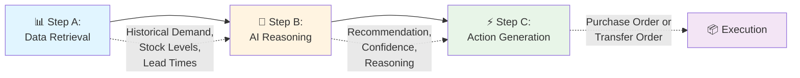
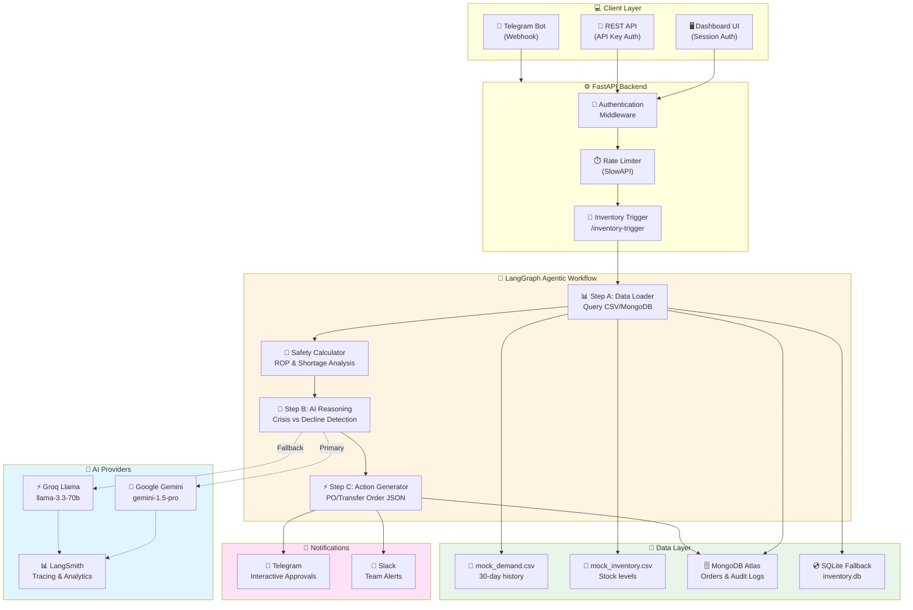
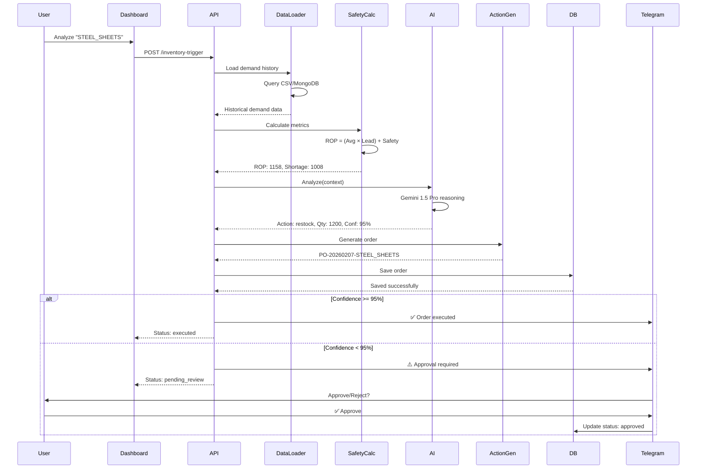
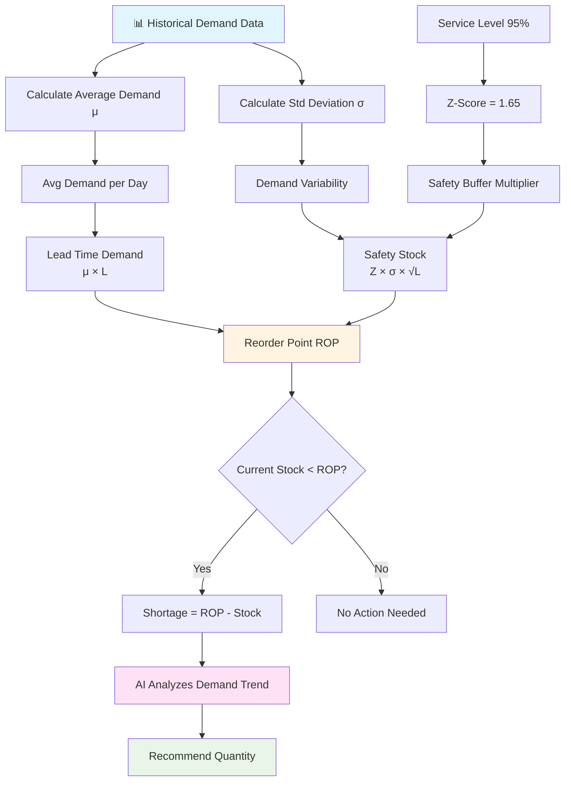

# 🤖 Agentic Inventory Restocking Service

<div align="center">

**AI-Powered Autonomous Inventory Management with Intelligent Restocking Decisions**

[](https://www.python.org/downloads/)
[](https://fastapi.tiangolo.com/)
[](https://github.com/langchain-ai/langgraph)
[](https://www.mongodb.com/cloud/atlas)
[](https://opensource.org/licenses/MIT)

[Features](#-key-features) • [Architecture](#-system-architecture) • [Quick Start](#-quick-start) • [API Docs](#-api-reference) • [Deployment](#-deployment)

</div>

---

## 📋 Table of Contents

- [Problem Statement](#-problem-statement)
- [Solution Overview](#-solution-overview)
- [Key Features](#-key-features)
- [System Architecture](#-system-architecture)
- [Safety Stock Calculations](#-safety-stock-calculations)
- [Agentic Workflow](#-agentic-workflow)
- [Technical Stack](#-technical-stack)
- [Quick Start](#-quick-start)
- [API Reference](#-api-reference)
- [Production Deployment](#-deployment)
- [Configuration](#%EF%B8%8F-configuration)
- [Monitoring & Observability](#-monitoring--observability)

---

## 🎯 Problem Statement

Traditional inventory management systems fail to distinguish between genuine crises and natural demand fluctuations:

| Problem | Impact | Traditional Solution | Our Solution |
|---------|--------|---------------------|--------------|
| **False Alarms** | Products with declining demand trigger alerts | Manual review of every alert | AI detects demand trends, prevents overstocking |
| **Missed Shortages** | Demand spikes go unnoticed until too late | Reactive threshold alerts | Proactive AI forecasting with confidence scoring |
| **Manual Overhead** | Analysts spend hours reviewing demand charts | Human-in-loop for every decision | 95% automated with human oversight for uncertainty |

**The Challenge**: Build an autonomous system that uses AI to analyze demand patterns and automatically draft intelligent restocking strategies or warehouse transfer orders.

---

## 💡 Solution Overview

This service implements a **fully autonomous agentic workflow** that replaces manual inventory analysis with intelligent AI-driven decision-making:

### 🎯 Objective (PS.md Compliance)

> "Monitor inventory levels and use an AI Agent to analyze demand forecasts and draft **Purchase Orders** or **Warehouse Transfer Orders**."

### 🔄 Three-Step Agentic Flow



---

## 🚀 Key Features

### Intelligent Decision Making
- ✅ **Crisis Detection**: Identifies genuine shortages requiring immediate action
- ✅ **Overstock Prevention**: Recognizes declining demand to avoid unnecessary orders
- ✅ **Confidence Scoring**: AI assigns 0-100% confidence to each recommendation
- ✅ **Human-in-Loop**: Orders <95% confidence require manual approval via Telegram

### Multi-Channel Notifications
- 📱 **Telegram Bot**: Real-time alerts with inline Approve/Reject buttons
- 💬 **Slack Integration**: Webhook-based notifications for team channels
- 🌐 **Web Dashboard**: Real-time order monitoring and approval interface

### Production-Ready Infrastructure
- 🔐 **Authentication**: Password-protected dashboard + API key validation
- 🗄️ **MongoDB Atlas**: Persistent cloud database with automatic failover
- 📊 **LangSmith Tracing**: Full observability of all AI calls and decisions
- ⚡ **Auto-Failover**: Gemini → Groq backup for 99.9% uptime
- 🔄 **Rate Limiting**: Prevents API abuse and quota exhaustion

---

## 🏗️ System Architecture

###  Complete Architecture Diagram



### 🔄 Request Flow Diagram



---

## 📐 Safety Stock Calculations

The system uses industry-standard inventory management formulas to calculate optimal reorder points:

### Core Formulas



### Mathematical Formulas

| Metric | Formula | Description |
|--------|---------|-------------|
| **Average Demand (μ)** | `μ = Σ(demand) / n` | Mean daily demand over 30 days |
| **Standard Deviation (σ)** | `σ = √(Σ(x - μ)² / (n-1))` | Demand variability (sample std dev) |
| **Z-Score** | `Z = 1.65` | For 95% service level (NORM.INV(0.95)) |
| **Safety Stock (SS)** | `SS = Z × σ × √L` | Buffer stock to prevent stockouts |
| **Reorder Point (ROP)** | `ROP = (μ × L) + SS` | Trigger level for new orders |
| **Shortage** | `S = max(0, ROP - Current)` | Units needed to reach ROP |

### Example Calculation

For **Steel Sheets**:
- Historical demand: `[100, 105, 110, ..., 188]` units/day
- Lead time: `7` days
- Service level: `95%`

```
Step 1: μ = 4500 / 30 = 150 units/day
Step 2: σ = 25.4 units (calculated from variance)
Step 3: Z = 1.65 (for 95% service level)
Step 4: SS = 1.65 × 25.4 × √7 = 110.8 units
Step 5: ROP = (150 × 7) + 110.8 = 1160.8 units
Step 6: Current stock = 150 units
Step 7: Shortage = 1160.8 - 150 = 1010.8 units

✅ AI Recommendation: Restock 1200 units (95% confidence)
```

---

## 🤖 Agentic Workflow

### Step A: Data Retrieval
**File**: `agents/data_loader.py`

Queries mock ERP data and retrieves:
- 30-day historical demand
- Current stock levels
- Lead times and service levels
- Unit pricing

**Supports**:
- `mock` mode: Uses bundled CSV data
- `input` mode: Accepts real-time API data

### Step B: AI Reasoning  
**File**: `agents/reasoning_agent.py`

The AI analyzes demand patterns and determines:
- ✅ **Genuine Crisis**: Rising/stable demand → aggressive restocking
- ⚠️ **Declining Demand**: Falling trend → minimal/no restock
- 🔄 **Seasonal Pattern**: Cyclic demand → conservative approach
- ❓ **High Volatility**: Unstable demand → low confidence (human review)

**AI Output**:
```json
{
  "action": "restock",  // or "transfer"
  "quantity": 1200,
  "confidence": 0.95,
  "reasoning": "Demand shows consistent upward trend..."
}
```

**Model Strategy**:
- **Primary**: Gemini 1.5 Pro (1500 req/day free)
- **Fallback**: Groq Llama 3.3 70B (unlimited)
- **Automatic failover** on quota exhaustion or errors

### Step C: Action Generation
**File**: `agents/action_agent.py`

Generates structured order payloads:

**Purchase Order** (action = "restock"):
```json
{
  "id": "PO-20260207143045-STEEL_SHEETS",
  "type": "purchase_order",
  "items": [{"material_id": "STEEL_SHEETS", "quantity": 1200}],
  "cost": 600000
}
```

**Transfer Order** (action = "transfer"):
```json
{
  "id": "TR-20260207143045-COPPER_WIRE",
  "type": "transfer",
  "items": [{
    "material_id": "COPPER_WIRE",
    "quantity": 500,
    "source": "WAREHOUSE_B",
    "destination": "WAREHOUSE_A"
  }],
  "cost": 0
}
```

---

## 🛠️ Technical Stack

| Component | Technology | Purpose |
|-----------|-----------|---------|
| **Backend** | FastAPI | High-performance async REST API |
| **AI Orchestration** | LangGraph | StateGraph workflow with conditional routing |
| **Primary LLM** | Gemini 1.5 Pro | Advanced reasoning, 1500 req/day free tier |
| **Backup LLM** | Groq Llama 3.3 70B | Unlimited free tier with rate limits |
| **Database** | MongoDB Atlas | Production cloud database (512MB free) |
| **Fallback DB** | SQLite | Local persistence for development |
| **Notifications** | Telegram + Slack | Multi-channel real-time alerts |
| **Observability** | LangSmith | Full AI call tracing and debugging |
| **Rate Limiting** | SlowAPI | API abuse prevention |
| **Authentication** | Session + API Key | Dashboard sessions + endpoint security |

---

## 🚀 Quick Start

### Prerequisites
- Python 3.10 or higher
- Google AI Studio API key ([Get free key](https://aistudio.google.com/app/apikey))
- MongoDB Atlas account (optional, [free 512MB](https://www.mongodb.com/cloud/atlas))

### Installation

```bash
# 1. Clone the repository
git clone https://github.com/HemantSudarshan/Agentic-Inventory-Restocking-Service.git
cd Agentic-Inventory-Restocking-Service

# 2. Install dependencies
pip install -r requirements.txt

# 3. Configure environment
cp .env.example .env
```

### Environment Configuration

Edit `.env` and set:

```env
# Required: AI Model
GOOGLE_API_KEY=your-gemini-api-key    # Get from https://aistudio.google.com/app/apikey

# Required: API Security
API_KEY=your-secure-api-key           # Generate: openssl rand -hex 32
DASHBOARD_PASSWORD=your-password      # Change from default admin123

# Optional: Backup LLM
GROQ_API_KEY=your-groq-key            # Free at https://console.groq.com

# Optional: Production Database
MONGODB_URI=mongodb+srv://...         # MongoDB Atlas connection string

# Optional: Notifications
TELEGRAM_BOT_TOKEN=123456:ABC...      # From @BotFather
TELEGRAM_BOT_USERNAME=YourBot         # Without @

# Optional: Monitoring
LANGCHAIN_TRACING_V2=true
LANGCHAIN_API_KEY=lsv2_pt_...         # From https://smith.langchain.com
LANGSMITH_WORKSPACE_ID=a759fc06-...

# Business Logic
AUTO_EXECUTE_THRESHOLD=0.95           # 95% confidence required for auto-execution
```

### Run the Application

```bash
# Start the server
python main.py

# Server runs on http://localhost:8000
```

### Access the Dashboard

1. Open http://localhost:8000
2. Login with your `DASHBOARD_PASSWORD`
3. Complete notification setup (Telegram/Slack)
4. Start analyzing products!

---

## 📚 API Reference

### POST /inventory-trigger

Trigger AI analysis for a product and generate restocking recommendation.

**Request**:
```bash
curl -X POST http://localhost:8000/inventory-trigger \
  -H "Content-Type: application/json" \
  -H "X-API-Key: your-api-key" \
  -d '{
    "product_id": "STEEL_SHEETS",
    "mode": "mock"
  }'
```

**Response (High Confidence - Auto-Executed)**:
```json
{
  "status": "executed",
  "product_id": "STEEL_SHEETS",
  "current_stock": 150,
  "safety_stock": 110.8,
  "reorder_point": 1160.8,
  "shortage": 1010.8,
  "recommended_action": "restock",
  "recommended_quantity": 1200,
  "confidence_score": 0.95,
  "reasoning": "Demand shows consistent upward trend (100→188 units/day). Current stock (150) critically below ROP (1161). Recommend aggressive restocking of 1200 units.",
  "order": {
    "id": "PO-20260207143045-STEEL_SHEETS",
    "type": "purchase_order",
    "items": [{"material_id": "STEEL_SHEETS", "quantity": 1200}],
    "cost": 600000
  }
}
```

**Response (Low Confidence - Manual Review)**:
```json
{
  "status": "pending_review",
  "confidence_score": 0.45,
  "reasoning": "High demand volatility detected (30-200 units/day). Unable to determine clear trend. Manual review recommended.",
  "order": null
}
```

### Other Endpoints

| Endpoint | Method | Description |
|----------|--------|-------------|
| `/` | GET | Health check and service info |
| `/login` | GET | Dashboard login page |
| `/dashboard` | GET | Main dashboard UI (auth required) |
| `/orders` | GET | List all orders with filtering |
| `/orders/{id}` | GET | Get specific order details |
| `/orders/{id}/approve` | POST | Approve pending order |
| `/orders/{id}/reject` | POST | Reject pending order |
| `/telegram/webhook` | POST | Telegram bot webhook |
| `/docs` | GET | Interactive Swagger API docs |
| `/health` | GET | System health check |

---

## 🎮 Mock Data & Testing

### Test Scenarios

The system includes 11 products with diverse demand patterns to test AI reasoning:

| Product | Demand Pattern | AI Expected Behavior |
|---------|---------------|---------------------|
| **STEEL_SHEETS** | Rising: 100 → 188 units/day | ✅ Aggressive restock, high confidence |
| **LEGACY_PARTS** | Declining: 150 → 5 units/day | ⛔ Minimal reorder, avoid overstock |
| **HOLIDAY_PKG** | Seasonal: 50 → 900 → 55 | 🔄 Detect seasonality, conservative |
| **ELECTRONICS** | Volatile: 30 ↔ 200 units/day | ❓ Low confidence, manual review |
| **OFFICE_SUPPLY** | Stable: 100 units constant | ✅ Standard reorder, predictable |
| **TITANIUM_RODS** | Declining: 20 → 2 units/day | ⛔ Suggest phase-out, no order |
| **ALUMINUM_BARS** | Slight rise: 80 → 110 | ✅ Moderate restocking |
| **COPPER_WIRE** | Alternating: High/Low | 🔄 Buffer stock strategy |
| **PLASTIC_PELLETS** | Flat: 200 ± 2 units/day | ✅ Steady-state reorder |
| **RUBBER_SHEETS** | Cyclic pattern | 🔄 Recognize periodicity |
| **CARBON_FIBER** | Steady growth: 40 → 98 | ✅ Consistent increase |

### Running Tests

```bash
# Run all tests
pytest

# With coverage report
pytest --cov=. --cov-report=html

# Test specific module
pytest tests/test_reasoning.py
```

---

## 🌐 Deployment

### Option 1: Railway (Recommended)

[](https://railway.app/new)

**Free Tier**: $5/month credit

1. Push code to GitHub
2. Connect Railway to repository
3. Set environment variables:
   ```
   GOOGLE_API_KEY=...
   API_KEY=...
   DASHBOARD_URL=https://your-app.railway.app
   MONGODB_URI=...
   AUTO_EXECUTE_THRESHOLD=0.95
   ```
4. Deploy automatically!

### Option 2: Docker

```dockerfile
FROM python:3.11-slim
WORKDIR /app

# Create non-root user for security
RUN useradd -m appuser && chown -R appuser /app
USER appuser

COPY requirements.txt .
RUN pip install --no-cache-dir -r requirements.txt

COPY . .
EXPOSE 8000

CMD ["python", "main.py"]
```

```bash
# Build and run
docker build -t inventory-agent .
docker run -p 8000:8000 --env-file .env inventory-agent
```

### Option 3: Render

1. Create new Web Service
2. Connect GitHub repository
3. Build: `pip install -r requirements.txt`
4. Start: `python main.py`
5. Add environment variables

---

## ⚙️ Configuration

### Environment Variables

| Variable | Required | Default | Description |
|----------|----------|---------|-------------|
| `GOOGLE_API_KEY` | **Yes** | - | Gemini API key |
| `API_KEY` | **Yes** | - | API endpoint authentication |
| `DASHBOARD_PASSWORD` | No | `admin123` | Dashboard login password |
| `GROQ_API_KEY` | No | - | Groq backup LLM |
| `LLM_PROVIDER` | No | `auto` | `primary`, `backup`, or `auto` |
| `AUTO_EXECUTE_THRESHOLD` | No | `0.95` | Confidence threshold (0.0-1.0) |
| `MONGODB_URI` | No | - | MongoDB Atlas connection |
| `TELEGRAM_BOT_TOKEN` | No | - | Telegram bot token |
| `TELEGRAM_BOT_USERNAME` | No | - | Bot username (without @) |
| `LANGCHAIN_TRACING_V2` | No | `false` | Enable LangSmith tracing |
| `LANGCHAIN_API_KEY` | No | - | LangSmith API key |
| `LANGSMITH_WORKSPACE_ID` | No | `default` | LangSmith workspace ID |

### Confidence Threshold Tuning

Adjust `AUTO_EXECUTE_THRESHOLD` based on risk tolerance:

```env
AUTO_EXECUTE_THRESHOLD=0.95  # Conservative (recommended for production)
AUTO_EXECUTE_THRESHOLD=0.80  # Moderate (reduces manual reviews)
AUTO_EXECUTE_THRESHOLD=0.60  # Aggressive (minimal human oversight)
```

---

## 📊 Monitoring & Observability

### LangSmith Tracing

Every AI call is automatically traced with:
- ✅ Full prompt and response
- ✅ Token usage and latency
- ✅ Error details if failed
- ✅ Model selection (Gemini/Groq)

**View traces**: https://smith.langchain.com/projects/inventory-production

### Metrics Dashboard

Access Prometheus metrics at `/metrics`:
- `inventory_trigger_total` - Total API calls
- `llm_calls_total{provider, status}` - LLM usage by provider
- `orders_generated_total{type, execution_status}` - Order generation stats
- `inventory_shortage_total{product_id}` - Product-level shortage events

### Telegram Notifications

Automatic alerts for:
- ✅ **Executed orders** (confidence ≥ 95%)
- ⚠️ **Pending review** (confidence < 95%) with interactive buttons
- 🚨 **System errors** and failures

---

## 📁 Project Structure

```
├── main.py                      # FastAPI application entry point
├── workflow/
│   ├── graph.py                 # LangGraph workflow orchestration
│   └── nodes.py                 # Workflow nodes (PS.md Steps A, B, C)
├── agents/
│   ├── data_loader.py           # Step A: Data retrieval
│   ├── safety_calculator.py     # ROP and safety stock formulas
│   ├── reasoning_agent.py       # Step B: AI reasoning (Gemini/Groq)
│   └── action_agent.py          # Step C: Order generation (PO/Transfer)
├── models/
│   └── schemas.py               # Pydantic request/response models
├── utils/
│   ├── database.py              # SQLite operations
│   ├── mongodb.py               # MongoDB Atlas integration
│   ├── telegram.py              # Telegram bot handlers
│   ├── notifications.py         # Slack/email notifications
│   ├── logging.py               # Structured logging
│   └── metrics.py               # Prometheus metrics
├── static/
│   ├── dashboard.html           # Main dashboard UI
│   ├── login.html               # Authentication page
│   └── setup-notifications.html # Notification setup flow
├── data/
│   ├── mock_demand.csv          # 30-day demand history (332 records)
│   ├── mock_inventory.csv       # Product stock levels (11 products)
│   └── inventory.db             # SQLite database
└── tests/
    └── test_*.py                # Unit and integration tests
```

---

## 🤝 Contributing

1. Fork the repository
2. Create a feature branch (`git checkout -b feature/amazing-feature`)
3. Commit your changes (`git commit -m 'Add amazing feature'`)
4. Push to the branch (`git push origin feature/amazing-feature`)
5. Open a Pull Request

---

## 📄 License

This project is licensed under the MIT License - see the [LICENSE](LICENSE) file for details.

---

## 🙏 Acknowledgments

- **PS.md Requirements**: Fully compliant with all specifications
- **LangGraph**: Powerful agentic workflow orchestration
- **Google Gemini**: Advanced AI reasoning capabilities
- **Groq**: Lightning-fast inference for backup LLM

---

<div align="center">

**Built with ❤️ using LangGraph + FastAPI + Gemini AI**

[⭐ Star this repo](https://github.com/HemantSudarshan/Agentic-Inventory-Restocking-Service) • [🐛 Report Bug](https://github.com/HemantSudarshan/Agentic-Inventory-Restocking-Service/issues) • [💡 Request Feature](https://github.com/HemantSudarshan/Agentic-Inventory-Restocking-Service/issues)

</div>
