# 🤖 Agentic Inventory Restocking Service

> AI-powered inventory management using LangGraph workflows and Gemini/Llama reasoning. Automatically drafts Restock Strategies and Transfer Orders when inventory falls below safety stock levels.

[](https://www.python.org/downloads/)
[](https://fastapi.tiangolo.com/)
[](https://github.com/langchain-ai/langgraph)
[](https://opensource.org/licenses/MIT)

---

## 📋 Table of Contents

- [Overview](#overview)
- [Architecture](#architecture)
- [Features](#features)
- [Quick Start](#quick-start)
- [Configuration](#configuration)
- [API Reference](#api-reference)
- [Mock Data & Test Scenarios](#mock-data--test-scenarios)
- [Deployment](#deployment)
- [Third-Party Integrations](#third-party-integrations)

---

## Overview

This service implements the **PS.md** specification:

| Requirement | Implementation | Status |
|-------------|----------------|--------|
| Backend = FastAPI or Flask | FastAPI | ✅ |
| AI Orchestration = LangGraph/CrewAI | LangGraph | ✅ |
| Model = GPT-4o-mini/Gemini 2.5/Llama 3 | Gemini + Groq (Llama 3.1) | ✅ |
| Data Source = SQLite or Pandas DataFrame | CSV + SQLite | ✅ |

### The Core Workflow (from PS.md)

1. **Inventory Trigger**: Detects when material falls below safety stock
2. **Step A (Data Retrieval)**: Agent queries mock "Demand Forecast" CSV
3. **Step B (Reasoning)**: AI determines if low stock is a crisis or if demand is dropping
4. **Step C (Action)**: Agent generates JSON payload for Purchase Order or Transfer Order

---

## Architecture

```mermaid
flowchart TB
    subgraph Client ["🖥️ Client Layer"]
        Dashboard["Dashboard UI<br>(HTML/JS)"]
        API["REST API<br>Requests"]
    end

    subgraph FastAPI ["⚡ FastAPI Backend"]
        Auth["Authentication<br>Middleware"]
        Endpoints["API Endpoints<br>/inventory-trigger"]
    end

    subgraph LangGraph ["🔄 LangGraph Workflow"]
        DataLoader["📊 Data Loader Node<br>Load from CSV/DB"]
        SafetyCalc["🧮 Safety Calculator<br>ROP, Safety Stock"]
        Reasoning["🤖 AI Reasoning Node<br>Gemini/Llama"]
        Action["📦 Action Generator<br>PO/Transfer Order"]
    end

    subgraph Data ["💾 Data Layer"]
        CSV["mock_demand.csv<br>mock_inventory.csv"]
        SQLite["inventory.db"]
    end

    subgraph AI ["🧠 AI Providers"]
        Gemini["Google Gemini<br>(Primary)"]
        Groq["Groq/Llama<br>(Backup)"]
    end

    subgraph Notifications ["📱 Notifications"]
        Telegram["Telegram Bot<br>Approval Workflow"]
        Slack["Slack Webhook<br>(Optional)"]
    end

    Dashboard --> Auth
    API --> Auth
    Auth --> Endpoints
    Endpoints --> DataLoader
    DataLoader --> CSV
    DataLoader --> SQLite
    DataLoader --> SafetyCalc
    SafetyCalc --> Reasoning
    Reasoning --> Gemini
    Reasoning --> Groq
    Reasoning --> Action
    Action --> Telegram
    Action --> Slack
    Action --> Dashboard
```



---

## Features

### 🎯 Core Features
- **AI-Powered Analysis**: Uses Gemini/Llama to analyze demand patterns
- **Smart Restocking**: Distinguishes between crisis vs. declining demand
- **Confidence Scoring**: Auto-executes high-confidence orders (≥60%)
- **Human-in-Loop**: Low-confidence orders require approval

### 📊 Dashboard
- Real-time inventory monitoring
- One-click AI analysis
- Order history tracking
- Status badges (Executed/Pending)

### 📱 Notifications
- **Telegram Bot**: Inline approval buttons, auto-registration
- **Slack Webhooks**: Configurable alerts
- **Multi-User Broadcasting**: All registered users receive alerts

---

## Quick Start

### Prerequisites
- Python 3.10+
- pip or uv package manager

### 1. Clone & Install

```bash
git clone https://github.com/HemantSudarshan/Agentic-Inventory-Restocking-Servic.git
cd Agentic-Inventory-Restocking-Servic
pip install -r requirements.txt
```

### 2. Configure Environment

```bash
cp .env.example .env
# Edit .env with your API keys
```

**Required:**
```env
GOOGLE_API_KEY=your-gemini-api-key        # Get from https://aistudio.google.com/app/apikey
API_KEY=your-secure-api-key               # For API authentication
```

**Optional:**
```env
GROQ_API_KEY=your-groq-api-key            # Backup LLM (FREE at https://console.groq.com/keys)
TELEGRAM_BOT_TOKEN=your-bot-token         # From @BotFather
DASHBOARD_URL=https://your-domain.com     # For production
```

### 3. Run the Application

```bash
python main.py
```

Access the dashboard at: **http://localhost:8000**

Default login: `admin123`

---

## Configuration

### Environment Variables

| Variable | Required | Default | Description |
|----------|----------|---------|-------------|
| `GOOGLE_API_KEY` | Yes | - | Gemini API key |
| `API_KEY` | Yes | - | API authentication key |
| `GROQ_API_KEY` | No | - | Backup LLM (Llama 3.1) |
| `LLM_PROVIDER` | No | `auto` | Options: `primary`, `backup`, `auto` |
| `DASHBOARD_PASSWORD` | No | `admin123` | Dashboard login |
| `TELEGRAM_BOT_TOKEN` | No | - | Telegram bot token |
| `TELEGRAM_CHAT_ID` | No | - | Fallback chat ID |
| `DASHBOARD_URL` | No | `http://localhost:8000` | For production links |
| `LOG_LEVEL` | No | `INFO` | Logging level |

### LLM Configuration

| Provider | Model | Use Case |
|----------|-------|----------|
| Gemini (Primary) | gemini-1.5-flash | Best reasoning quality |
| Groq (Backup) | llama-3.1-8b-instant | Fast fallback, FREE tier |

---

## API Reference

### Trigger Inventory Analysis

```bash
POST /inventory-trigger
Content-Type: application/json
X-API-Key: your-api-key

{
  "product_id": "STEEL_SHEETS",
  "mode": "mock"
}
```

**Response:**
```json
{
  "status": "executed",
  "product_id": "STEEL_SHEETS",
  "current_stock": 150,
  "safety_stock": 108.19,
  "reorder_point": 1158.19,
  "shortage": 1008.19,
  "recommended_action": "restock",
  "recommended_quantity": 1200,
  "confidence_score": 0.95,
  "reasoning": "The current stock is 150 units, which is 1005 units below...",
  "order": {
    "order_id": "PO-20260207-STEEL_SHEETS",
    "cost": 600000
  }
}
```

### Additional Endpoints

| Endpoint | Method | Description |
|----------|--------|-------------|
| `/login` | GET | Dashboard login page |
| `/dashboard` | GET | Main dashboard |
| `/orders` | GET | List all orders |
| `/health` | GET | Health check |
| `/docs` | GET | Swagger documentation |

---

## Mock Data & Test Scenarios

The mock data covers **11 products** with diverse demand patterns:

| Product | Pattern | Scenario |
|---------|---------|----------|
| Steel Sheets | 📈 Rising | Increasing demand, needs aggressive restocking |
| Legacy Parts | 📉 Falling | Decreasing demand, avoid overstock |
| Holiday Packaging | 🎄 Seasonal | Spike then drop, seasonal adjustment |
| Electronic Components | 📊 Volatile | Unpredictable, requires buffer stock |
| Office Supplies | ➡️ Stable | Consistent demand, standard reordering |
| Titanium Rods | 📉 Declining | Phasing out, minimal restocking |
| Aluminum Bars | 📈 Slight Rise | Moderate growth pattern |
| Copper Wire | 📊 Variable | Alternating high/low demand |
| Plastic Pellets | ➡️ Flat | No trend, stable demand |
| Rubber Sheets | 📊 Cyclic | Oscillating pattern |
| Carbon Fiber | 📈 Steady Growth | Consistent increase |

### Data Files

- `data/mock_inventory.csv` - Current stock levels, lead times, prices
- `data/mock_demand.csv` - 30-day demand history per product
- `data/inventory.db` - SQLite database for order tracking

---

## Deployment

### Local Development

```bash
python main.py
# Runs on http://localhost:8000
```

### Production Deployment

#### Option 1: Railway (Recommended, FREE)

1. Push to GitHub
2. Connect Railway to your repo
3. Set environment variables in Railway dashboard
4. Deploy automatically

```env
# Railway environment variables
GOOGLE_API_KEY=your-key
API_KEY=your-api-key
DASHBOARD_URL=https://your-app.railway.app
```

#### Option 2: Render (FREE)

1. Create new Web Service
2. Connect GitHub repo
3. Set build command: `pip install -r requirements.txt`
4. Set start command: `python main.py`
5. Configure environment variables

#### Option 3: Docker

```dockerfile
FROM python:3.11-slim
WORKDIR /app
COPY requirements.txt .
RUN pip install -r requirements.txt
COPY . .
EXPOSE 8000
CMD ["python", "main.py"]
```

```bash
docker build -t inventory-agent .
docker run -p 8000:8000 --env-file .env inventory-agent
```

---

## Third-Party Integrations

### Required (FREE)

| Service | Purpose | How to Get |
|---------|---------|------------|
| **Google AI Studio** | Gemini API | [aistudio.google.com](https://aistudio.google.com/app/apikey) |

### Optional (All FREE Tiers)

| Service | Purpose | How to Get |
|---------|---------|------------|
| **Groq** | Backup LLM (Llama) | [console.groq.com](https://console.groq.com/keys) - FREE |
| **Telegram Bot** | Mobile notifications | Talk to [@BotFather](https://t.me/BotFather) - FREE |
| **MongoDB Atlas** | Production database | [mongodb.com/cloud](https://www.mongodb.com/cloud/atlas) - FREE 512MB |
| **Railway** | Hosting | [railway.app](https://railway.app) - FREE $5/month |
| **Render** | Hosting | [render.com](https://render.com) - FREE tier |
| **ngrok** | Local tunnel testing | [ngrok.com](https://ngrok.com) - FREE |

### Database Options

| Database | Free Tier | Best For |
|----------|-----------|----------|
| **SQLite** (default) | Unlimited | Development, small scale |
| **MongoDB Atlas** | 512MB | Flexible schema, cloud |
| **Supabase** | 500MB | PostgreSQL, real-time |
| **PlanetScale** | 5GB | MySQL, serverless |
| **Neon** | 512MB | PostgreSQL, serverless |

---

## Project Structure

```
├── main.py                 # FastAPI application entry point
├── workflow/
│   ├── graph.py            # LangGraph workflow definition
│   └── nodes.py            # Individual workflow nodes
├── agents/
│   ├── reasoning_agent.py  # AI reasoning with Gemini/Llama
│   ├── data_loader.py      # Data retrieval logic
│   ├── safety_calculator.py # ROP & safety stock calculations
│   └── action_agent.py     # Order generation
├── models/
│   └── schemas.py          # Pydantic models
├── utils/
│   ├── telegram.py         # Telegram bot integration
│   └── notifications.py    # Slack/email notifications
├── static/
│   ├── dashboard.html      # Main dashboard UI
│   ├── login.html          # Authentication page
│   └── setup-notifications.html
├── data/
│   ├── mock_demand.csv     # 30-day demand history
│   ├── mock_inventory.csv  # Product inventory levels
│   └── inventory.db        # SQLite database
└── tests/
    └── test_*.py           # Test files
```

---

## License

MIT License - see [LICENSE](LICENSE) for details.

---

## Contributing

1. Fork the repository
2. Create a feature branch
3. Make your changes
4. Submit a pull request

---

**Built with ❤️ using LangGraph + FastAPI + Gemini AI**
